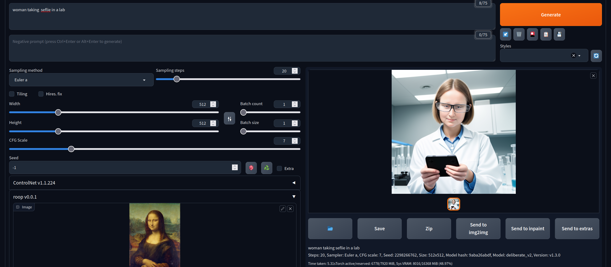

# roop for StableDiffusion

This is an extension for StableDiffusion's [AUTOMATIC1111 web-ui](https://github.com/AUTOMATIC1111/stable-diffusion-webui/) that allows face-replacement in images. It is based on [roop](https://github.com/s0md3v/roop) but will be developed seperately.

### Disclaimer

This software is meant to be a productive contribution to the rapidly growing AI-generated media industry. It will help artists with tasks such as animating a custom character or using the character as a model for clothing etc.

The developers of this software are aware of its possible unethical applicaitons and are committed to take preventative measures against them. It has a built-in check which prevents the program from working on inappropriate media. We will continue to develop this project in the positive direction while adhering to law and ethics. This project may be shut down or include watermarks on the output if requested by law.

Users of this software are expected to use this software responsibly while abiding the local law. If face of a real person is being used, users are suggested to get consent from the concerned person and clearly mention that it is a deepfake when posting content online. Developers of this software will not be responsible for actions of end-users.

## Installation
First of all, if you can't install it for some reason, don't open an issue here. Google your errors.

> On Windows, download and install [Visual Studio](https://visualstudio.microsoft.com/downloads/). During the install, make sure to include the Python and C++ packages.

+ Run this command: `pip install insightface==0.7.3`
+ In web-ui, go to the "Extensions" tab and use this URL `https://github.com/s0md3v/sd-webui-roop` in the "install from URL" tab.
+ Close webui and run it again
+ If you encounter `'NoneType' object has no attribute 'get'` error, download the [inswapper_128.onnx](https://huggingface.co/henryruhs/roop/resolve/main/inswapper_128.onnx) model and put it inside `<webui_dir>/models/roop/` directory.

For rest of the errors, use google. Good luck.

## Usage

1. Under "roop" drop-down menu, import an image containing a face.
2. Turn on the "Enable" checkbox
3. That's it, now the generated result will have the face you selected

## Tips
#### Getting good quality results
First of all, make sure the "Restore Face" option is enabled. You can also try the "Upscaler" option or for more finer control, use an upscaler from the "Extras" tab.

For even better quality, use img2img with denoise set to `0.1` and gradually increase it until you get a balance of quality and resembelance.

#### Replacing specific faces
If there are multiple faces in an image, select the face numbers you wish to swap using the "Comma separated face number(s)" option.

#### The face didn't get swapped?
Did you click "Enable"?

If you did and your console doesn't show any errors, it means roop detected that your image is either NSFW or wasn't able to detect a face at all.

### FAQ

#### Why GPU is not supported ?

Adding support for the GPU is easy in itself. Simply change the onnxruntime implementation and change the providers in the swapper. You can try this with roop.

If it's so easy, why not make it an option? Because sd models already take a lot of vram, and adding the model to the GPU doesn't bring any significant performance gains as it is. It's especially useful if you decide to handle a lot of frames and video. Experience shows that this is more trouble than it's worth. That's why it's pointless to ask for this feature.

To convince yourself, you can follow this guide https://github.com/s0md3v/roop/wiki/2.-Acceleration and change the providers in the swapper.

#### What is upscaled inswapper in sd roop options ?

It's a test to add an upscale of each face with LDSR before integrating it into the image. This is done by rewriting a small portion of the insightface code. This results in a slightly better quality face, at the expense of a little time. In some cases, this may avoid the need to use codeformer or gfpgan.

#### What is face blending ?

Insighface works by generating an embedding for each face. This embedding is a representation of the face's characteristics. Multiple faces embedding can be averaged to generate a blended face. 

This has several advantages:

+ create a better quality embedding based on several faces
+ create a face composed of several people.

To create a composite face, you can either use the checkpoint builder. or drop several images into image batch sources.

#### What is a face checkpoint ?

A face checkpoint can be created from the tab in sd (build tool). It will blend all the images dropped into the tab and save the embedding to a file.

The advantage is that an embedding is very small (2kb). And can be reused later without the need for additional calculations.

Checkpoints are pkl files. You need to be very careful when exchanging this type of file, as they are not secure by default and can execute potentially malicious code.

#### How similarity is determined ?

Similarity is determined by comparing embeddings. A score of 1 means that the two faces are exactly the same. A score of 0 means that the faces are different.

You can remove images from the results if the generated image doesn't match a reference by using the sliders in the faces tabs.

#### What model is used?

The model used is based on insightface's inswapper. More specifically [here](https://github.com/deepinsight/insightface/blob/fc622003d5410a64c96024563d7a093b2a55487c/python-package/insightface/model_zoo/inswapper.py#L12) 

The model was made public for a time by the insightface team for research use. They have not published any information on the training method.

The model produces faces of 128x128 in resolution, which is low. You need to upscale them to get a correct result. The insightface code is not designed for higher resolutions (see the [Router] class (https://github.com/deepinsight/insightface/blob/fc622003d5410a64c96024563d7a093b2a55487c/python-package/insightface/model_zoo/model_zoo.py#L35)).

#### Why not use simswap ?

The simswap models are based on older insightface architectures and simswap is not released as a python package. Its use would be very complex for a gain that is not certain.